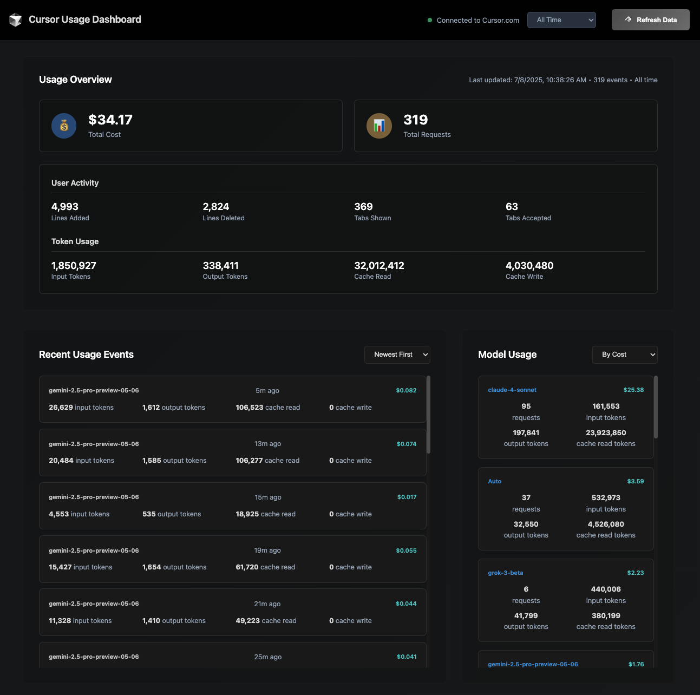
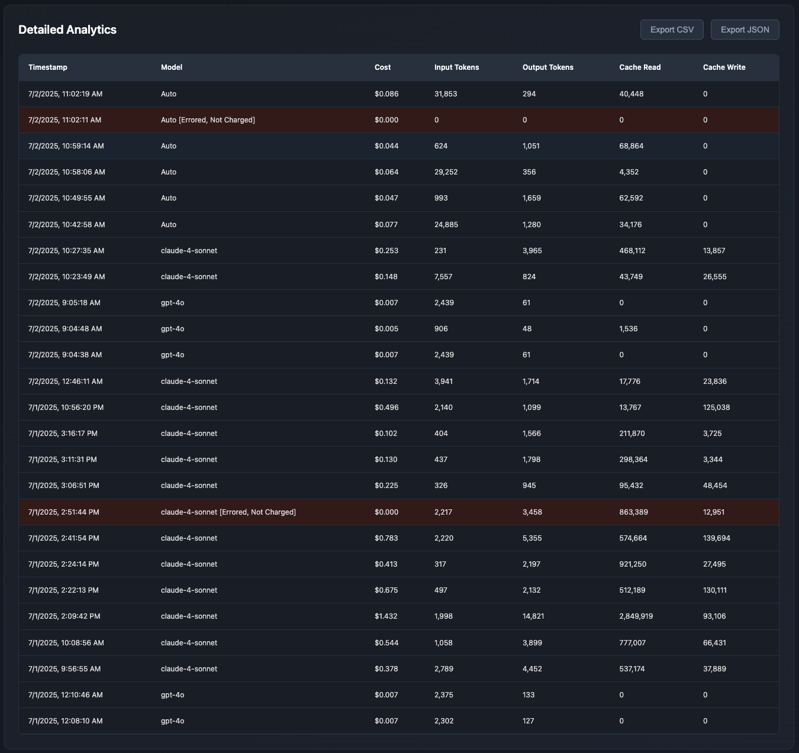

# Cursor Usage Tracker Chrome Extension

A Chrome extension that provides detailed analytics and usage tracking for your Cursor.com account. Monitor your AI model usage, costs, and token consumption with advanced filtering options.

## Screenshots





## Features

🔍 **Detailed Usage Analytics**

- Real-time usage data from Cursor.com API
- Token consumption tracking (input, output, cache read/write)
- Cost analysis in dollars
- Request count monitoring

📊 **Advanced Filtering**

- Time-based filters (Today, Yesterday, Last 4 hours, Last 24 hours, Last 7 days)
- Custom date range selection
- Model-specific breakdown
- Real-time data updates

💡 **User-Friendly Interface**

- Modern dark theme design
- Responsive layout
- Visual statistics cards
- Detailed usage events list
- Model usage breakdown

## Installation

### Method 1: Load Unpacked Extension (Recommended for Development)

1. **Download the Extension Files**

   - Clone or download this repository
   - Ensure all files are in a single directory:
     - `manifest.json`
     - `background.js`
     - `content.js`
     - `popup.html`
     - `popup.css`
     - `popup.js`

2. **Enable Developer Mode in Chrome**

   - Open Chrome and navigate to `chrome://extensions/`
   - Toggle "Developer mode" in the top right corner

3. **Load the Extension**

   - Click "Load unpacked"
   - Select the directory containing the extension files
   - The extension should now appear in your extensions list

4. **Pin the Extension (Optional)**
   - Click the puzzle piece icon in the Chrome toolbar
   - Find "Cursor Usage Tracker" and click the pin icon

## Usage

### Prerequisites

- You must be logged into [cursor.com](https://www.cursor.com) in the same browser
- Your Cursor account must have usage data available

### Using the Extension

1. **Navigate to Cursor.com**

   - Open cursor.com in a new tab
   - Ensure you're logged into your account

2. **Open the Extension**

   - Click the Cursor Usage Tracker icon in your Chrome toolbar
   - The extension will automatically fetch your usage data

3. **Analyze Your Usage**
   - **Statistics Overview**: View total costs, token usage, and request counts
   - **Time Filters**: Use predefined filters or set custom date ranges
   - **Usage Events**: Browse detailed usage events with timestamps and costs
   - **Model Breakdown**: See usage statistics broken down by AI model

### Available Filters

- **All Time**: Show all available usage data
- **Today**: Current day's usage (since midnight)
- **Yesterday**: Previous day's usage
- **Last 4 Hours**: Usage from the past 4 hours
- **Last 24 Hours**: Usage from the past 24 hours
- **Last 7 Days**: Usage from the past week
- **Custom Range**: Set specific start and end dates/times

### Data Refresh

- Click the refresh button (↻) in the header to fetch latest data
- Data is automatically cached for 1 minute to improve performance
- Force refresh clears the cache and fetches fresh data from the API

## Data Privacy

- The extension only accesses data from cursor.com when you're logged in
- All data processing happens locally in your browser
- No usage data is transmitted to external servers
- The extension uses Chrome's storage API for temporary caching only

## Troubleshooting

### Extension Not Loading Data

1. **Check Login Status**

   - Ensure you're logged into cursor.com
   - Try refreshing the cursor.com page

2. **Clear Cache**

   - Click the refresh button in the extension
   - Or disable/re-enable the extension in Chrome settings

3. **Check Permissions**
   - The extension requires access to cursor.com
   - Check that permissions haven't been blocked

### API Errors

- **403/401 Errors**: You may not be logged in or session expired
- **404 Errors**: The API endpoint may have changed
- **Network Errors**: Check your internet connection

### No Data Showing

- Ensure your Cursor account has usage data
- Try different time filters
- Check if you're using a trial account with limited data

## Technical Details

### Architecture

- **Manifest V3**: Uses modern Chrome extension architecture
- **Background Script**: Handles API requests and data caching
- **Content Script**: Monitors login status on cursor.com
- **Popup Interface**: Provides the main user interface

### Permissions Required

- `activeTab`: Access to the current tab for API requests
- `storage`: Local data caching
- `host_permissions`: Access to cursor.com for API calls

### API Integration

- Fetches data from `https://www.cursor.com/api/dashboard/get-monthly-invoice`
- Uses existing session cookies for authentication
- Processes usage events and token data

## Development

### File Structure

```
cursor-usage-tracker/
├── manifest.json          # Extension configuration
├── background.js          # Service worker for API handling
├── content.js            # Content script for cursor.com
├── popup.html            # Main interface HTML
├── popup.css             # Styling and dark theme
├── popup.js              # Interface logic and data processing
└── README.md             # This file
```

### Contributing

1. Fork the repository
2. Make your changes
3. Test thoroughly with different usage scenarios
4. Submit a pull request

## License

This project is open source and available under the MIT License.

## Disclaimer

This extension is not officially affiliated with Cursor or Anysphere. It's a community-built tool for personal usage tracking. Use at your own discretion and ensure compliance with Cursor's terms of service.
